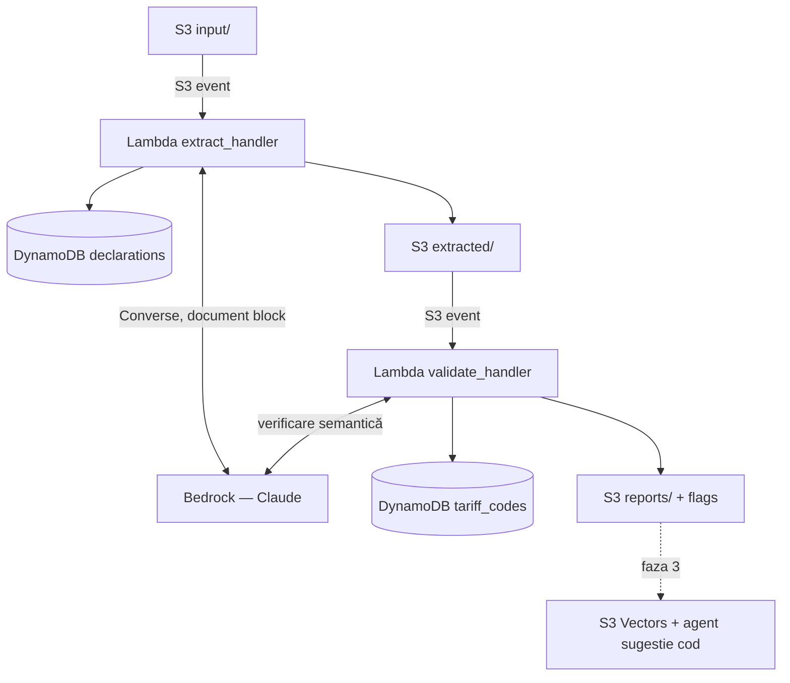

# Analizor Declarații Vamale — Arhitectură

> Stack: AWS serverless (scale-to-zero) + Claude pe Bedrock. Buget: $200 credite.
> Principiu: extracția e comodizată și interschimbabilă; valoarea produsului stă în
> motorul de validare + nomenclatorul structurat (`tariff_codes`).

## 1. Vedere de ansamblu



Cost idle al întregii arhitecturi: **$0/lună**. Toate componentele sunt
serverless și se plătesc doar la utilizare. Nu există niciun serviciu cu
floor provizionat (motivul pentru care OpenSearch Serverless lipsește: are
un minim de ~$350–700/lună pentru o colecție goală).

## 2. Componente

| Componentă | Serviciu AWS | Rol | Cost |
|---|---|---|---|
| Ingestie | S3 `customs-analyzer-{env}`, prefix `input/` | primește PDF/scan | ~$0 |
| Trigger | S3 Event Notification | pornește extracția la upload | $0 |
| Extracție | Lambda `extract_handler` → Bedrock (Claude, Converse API, `document` block) | PDF → JSON pe casetele SAD | ~$0.02–0.05/doc |
| Stare | DynamoDB `declarations` (on-demand) | status + date extrase + flags | ~$0 |
| Sursa de adevăr | DynamoDB `tariff_codes` | nomenclator + taxe per cod | ~$0 |
| Validare | Lambda `validate_handler` | 3 verificări deterministe + 1 semantică (Bedrock) | ~$0.01/doc |
| Rapoarte | S3 `reports/` | raport JSON per declarație | ~$0 |
| Sugestie cod (faza 3) | Bedrock Knowledge Base + **S3 Vectors** | k-NN peste nomenclator → coduri candidate | ~$0 idle |
| Guardrail | AWS Budgets | alerte $20 / $50 / $100 | $0 |

## 3. Fluxul de date

1. PDF-ul ajunge la `s3://customs-analyzer-{env}/input/{uuid}.pdf`.
2. S3 event → `extract_handler`.
3. Bedrock Converse (document block, `temperature=0`) → JSON pe schema SAD
   (logica există deja în `extract_declaration.py`; se portează ca handler).
4. Handler-ul scrie `extracted/{uuid}.json` + item în `declarations`
   (`status=EXTRACTED`).
5. S3 event pe `extracted/` → `validate_handler`, care rulează cele patru
   verificări (secțiunea 5).
6. Scrie `reports/{uuid}.json` + `status=VALIDATED` sau `FLAGGED`.
7. *(faza 3)* Dacă verificarea semantică dă `MISMATCH` → agentul de sugestie:
   embed descrierea mărfii → k-NN în S3 Vectors peste nomenclator → Claude
   ordonează candidații și adaugă `suggested_codes` în raport.

## 4. Modelul de date

### DynamoDB `tariff_codes`

| Atribut | Tip | Notă |
|---|---|---|
| `code` (PK) | S | cod tarifar 8–9 cifre, fără puncte |
| `description_ro`, `description_ru` | S | descrierea oficială a poziției |
| `unit` | S | unitatea suplimentară cerută (dacă există) |
| `duty_rate` | N/S | taxa vamală (%; sau valoare specifică) |
| `vat_rate` | N | TVA (standard 20% în MD) |
| `excise` | M | reguli acciz dacă e cazul (alcool/tutun/combustibil) |
| `chapter`, `notes` | S | capitol NC + note relevante |

Seed: script one-off din **Tariful Vamal Integrat al Republicii Moldova**
(Serviciul Vamal). Bază: HS 6 cifre (WCO) → Nomenclatura Combinată 8 cifre
(aliniată UE) → extensii naționale. Efortul real e achiziția și curățarea
acestor date, nu AI-ul.

### DynamoDB `declarations`

| Atribut | Tip | Notă |
|---|---|---|
| `declaration_id` (PK) | S | uuid |
| `status` | S | `EXTRACTED` / `VALIDATED` / `FLAGGED` / `ERROR` |
| `s3_key`, `created_at` | S | trasabilitate |
| `extracted` | M | JSON-ul extras |
| `validation` | M | rezultatele celor 4 verificări |

GSI opțional `status-created_at` pentru listare în UI (faza 3).

### Layout S3

```
customs-analyzer-{env}/
├── input/        # PDF-uri brute
├── extracted/    # JSON structurat per declarație
└── reports/      # raport de validare per declarație
```

## 5. Cele patru verificări

1. **Format** *(determinist)* — codul există în `tariff_codes`; număr corect
   de cifre; țări ISO-3166; monedă ISO-4217.
2. **Fiscal** *(determinist)* — recalculează: taxă = valoare_în_vamă ×
   `duty_rate`; TVA 20% pe baza corectă; acciz dacă poziția o cere. Compară
   cu caseta 47, toleranță ±0.5%.
3. **Consistență** *(determinist)* — masa netă ≤ masa brută; suma articolelor
   ≈ totalul facturat (caseta 22); unitatea suplimentară cerută de cod e
   prezentă; preferința DCFTA revendicată doar cu origine eligibilă.
4. **Semantic** *(Claude)* — descrierea mărfii (caseta 31) vs descrierea
   oficială a codului declarat (caseta 33) → `MATCH` / `MISMATCH` /
   `UNCERTAIN` + motivare. Prinde atât erori oneste cât și subclasificări
   intenționate pentru taxă mai mică. Ăsta e diferențiatorul produsului.

### Structura raportului (schiță)

```json
{
  "declaration_id": "…",
  "checks": {
    "format":      {"status": "PASS"},
    "fiscal":      {"status": "FAIL", "expected": 1240.50, "declared": 980.00},
    "consistency": {"status": "PASS"},
    "semantic":    {"status": "MISMATCH", "confidence": 0.87,
                    "reasoning": "…", "suggested_codes": []}
  },
  "verdict": "FLAGGED"
}
```

## 6. Fazele de build

- **Faza 1 — pipeline determinist.** Portare `extract_declaration.py` în
  `extract_handler`; bucket + event notifications; tabelele DynamoDB; seed
  `tariff_codes`; verificările 1–3. Livrabil: analizor funcțional cap-coadă,
  fără LLM la validare.
- **Faza 2 — verificarea semantică.** Prompt + logică pentru descriere ↔ cod;
  raportul JSON complet; (opțional) notificare SNS/email la `FLAGGED`.
- **Faza 3 — sugestie + HITL.** S3 Vectors peste nomenclator (embeddings
  Titan/Cohere pe Bedrock); agentul de sugestie cod; mini-UI Next.js pentru
  verificare umană.
- **Faza 4 (opțional) — grounding vizual.** Click pe câmp → highlight pe
  document. Necesită geometrie (bounding boxes), pe care Converse nu o
  returnează → se adaugă Textract sau Mistral OCR în paralel, doar pentru
  coordonate.

## 7. Modelul de cost pe $200

- **Idle: $0/lună.** Nimic provizionat.
- **Per document:** extracție ~3–6k tokeni in + ~1.2k out. Cu Sonnet
  (~$3/M in, ~$15/M out) ≈ **$0.03–0.05/doc**; semantica adaugă ~$0.01.
  Cu Haiku la dezvoltare: ~$0.01/doc total.
- **Concluzie:** mii de documente testate din $200, cu marjă mare.
- **Capcane evitate explicit:**
  - OpenSearch Serverless (floor ~$350–700/lună) → folosim S3 Vectors.
  - NAT Gateway (~$32/lună + trafic) → Lambda NU se pune în VPC; nu are nevoie.
  - CloudWatch Logs nelimitate → retenție 7 zile pe log groups.
- **Obligatoriu înainte de deploy:** AWS Budgets cu alerte la $20/$50/$100;
  verifică data de expirare a creditelor.

## 8. Decizii și trade-off-uri

- **Claude (Bedrock) vs Textract la extracție:** RO/RU nativ, extracție
  schema-driven într-un singur apel, același model refolosit la semantică.
  Trade-off: fără bounding boxes → grounding amânat în faza 4.
- **S3 event chaining vs Step Functions:** pornim cu chaining (simplu, zero
  cost). Trecem la Step Functions Express când fluxul crește — retry-uri și
  vizibilitate, tot ieftin.
- **DynamoDB vs Postgres pentru nomenclator:** lookup pe cheie → DynamoDB
  on-demand, $0 idle. Dacă apar interogări relaționale complexe → Aurora
  Serverless v2 cu `min_capacity=0`.
- **Regiune:** `eu-central-1` (Frankfurt, cea mai apropiată de MD). Verifică
  întâi în Bedrock → Model access că modelul Claude dorit e disponibil acolo;
  ID-urile noi cer prefix de inference profile (`eu.`).
- **Securitate:** bucket privat, SSE-S3 default; declarațiile conțin date
  comerciale și personale — nu loga conținutul lor în CloudWatch. IAM minimal
  per Lambda: `bedrock:InvokeModel`, `s3:GetObject`/`PutObject` pe prefixele
  proprii, `dynamodb:GetItem`/`PutItem` pe tabelele proprii.
